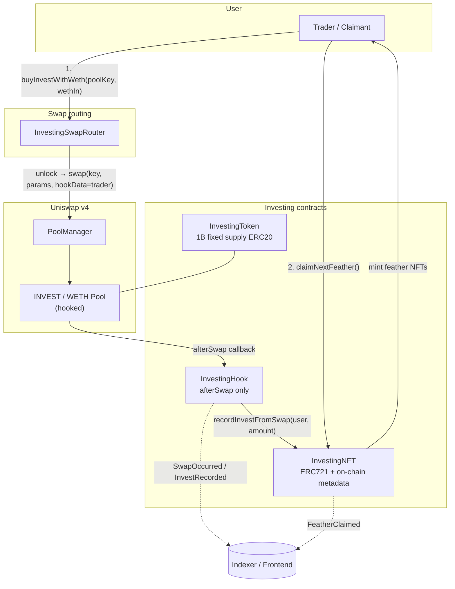
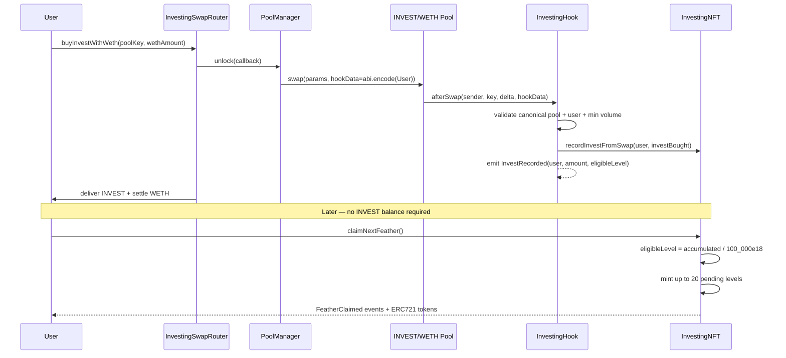
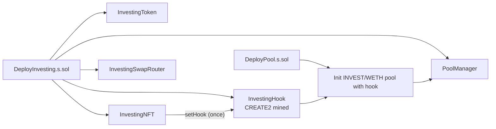

# Investing Protocol — Architecture

End-to-end flow for swap-earned feather NFTs on Robinhood Chain via Uniswap v4.

## System diagram



## Sequence: buy → volume → claim



## Contract responsibilities

| Contract | Responsibility |
|----------|----------------|
| **InvestingToken** | Mints 1B INVEST to deployer at construction. No further mint/burn. |
| **InvestingNFT** | Stores `investAccumulated`, `highestLevel`; mints on claim; on-chain JSON/SVG `tokenURI`. |
| **InvestingHook** | v4 `IHooks` with `afterSwap` only. Validates pool, attributes trader, records buy volume. |
| **InvestingSwapRouter** | Wraps `PoolManager.unlock` / `swap`; passes `abi.encode(msg.sender)` as `hookData`. |
| **PoolManager** | Uniswap v4 singleton executing swaps and liquidity ops. |

## Data flow

```
investAccumulated[user]  ←  Σ(INVEST bought per qualifying swap)
eligibleLevel[user]      ←  investAccumulated / TOKENS_PER_LEVEL (100_000)
highestLevel[user]       ←  highest feather level already minted
claimable                ←  eligibleLevel - highestLevel (max 20 per tx)
```

Volume is recorded at **swap time** in the hook. Claiming never reads the user's INVEST wallet balance.

## Deployment topology



1. Deploy token, NFT, mined hook, router, pool manager.
2. `InvestingNFT.setHook(hook)` — one-time, deployer-only.
3. `DeployPool.s.sol` initializes the canonical pool with the hook address.
4. LP seeds liquidity; frontend loads `deployments/latest.json`.

## Security properties

| Property | Mechanism |
|----------|-----------|
| **Hook-only volume writes** | `InvestingNFT.recordInvestFromSwap` is `onlyHook`; arbitrary callers cannot inflate volume. |
| **No auto-mint in hook** | Hook records volume only. NFTs mint only when the user calls `claimNextFeather()`. |
| **Swap-earned, not balance-held** | Eligibility uses cumulative buys; users can sell INVEST and still claim earned levels. |
| **Sells do not count** | `_investBought` requires positive INVEST delta; sells are ignored for progression. |
| **Anti-wash threshold** | Swaps buying &lt; 1,000 INVEST do not update `investAccumulated`. |
| **Canonical pool gate** | Hook ignores swaps on pools that are not INVEST/WETH. |
| **Router attribution** | Contract `sender` without `hookData` is ignored (prevents router self-credit). EOAs swapping directly may use `sender`. |
| **Reentrancy-safe claims** | `claimNextFeather()` uses `nonReentrant`. |
| **Claim gas cap** | Max 20 feathers per transaction prevents unbounded mint loops. |
| **One-time hook wiring** | `setHook` is deployer-only and cannot be changed after first set. |
| **Minimal hook permissions** | Only `afterSwap` enabled; no liquidity or initialize hooks. |
| **Fixed token supply** | 1B cap at deploy; burns disabled. |
| **CREATE2 hook address** | Hook mined with `AFTER_SWAP_FLAG` so v4 accepts the callback. |

## Trust boundaries

- **Trusted:** Deployer sets hook once; pool is initialized with the correct hook address.
- **Untrusted:** Swappers, routers, NFT buyers on secondary markets.
- **Assumption:** Users trade via `InvestingSwapRouter` (or pass `abi.encode(trader)` in `hookData`) so volume credits the intended wallet.

## External dependencies

- Uniswap v4 core (`PoolManager`, `IHooks`, `BalanceDelta`)
- OpenZeppelin ERC20 / ERC721 / `ReentrancyGuard`
- Robinhood Chain WETH and RPC/explorer

## Related docs

- [INDEXER.md](./INDEXER.md) — event indexing and subgraph schema
- [TOKENOMICS_EXECUTION.md](./TOKENOMICS_EXECUTION.md) — LP seeding and treasury allocation
- [../TOKENOMICS.md](../TOKENOMICS.md) — supply and progression rules
- [../LAUNCH.md](../LAUNCH.md) — launch checklist
